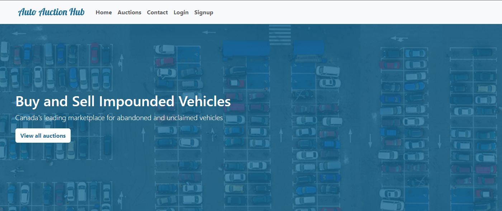
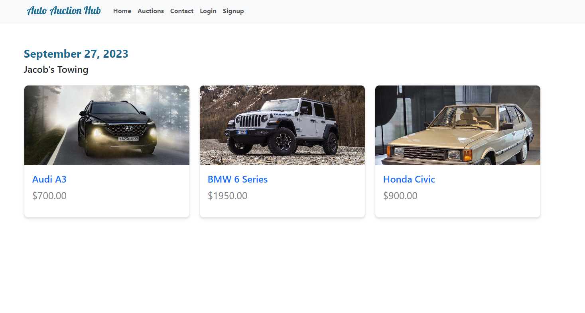
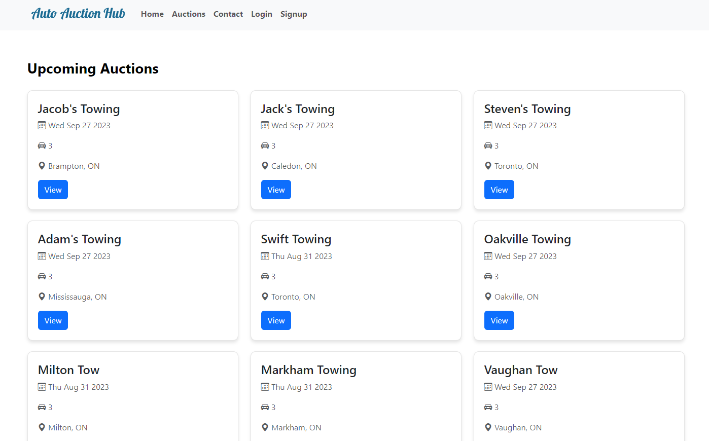
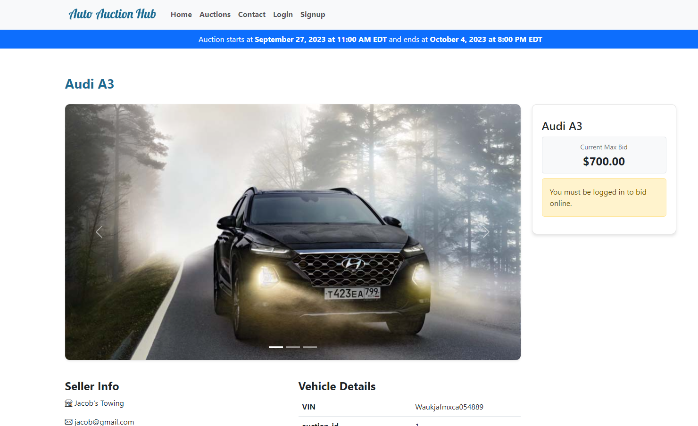
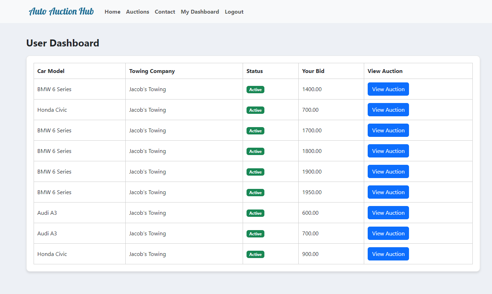
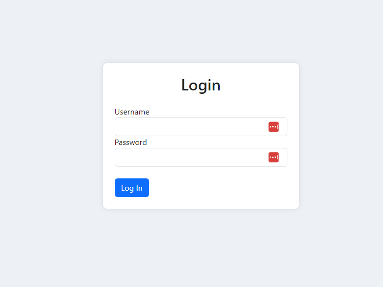
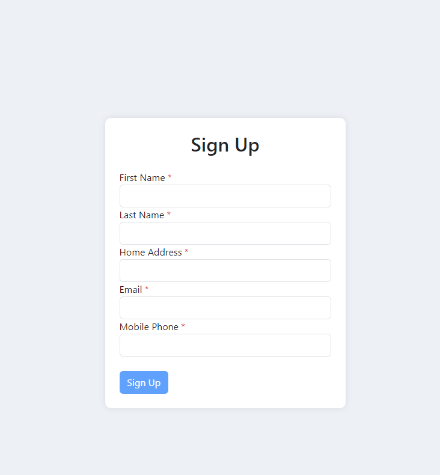

# Auto Auction Hub Web Application

## Overview

The Auto Auction Hub Web Application is a platform for buying and selling impounded vehicles in Canada. It provides a user-friendly interface for tow yards and impounds to list their vehicles for sale and reach a wider audience of interested buyers. This README provides an overview of the different components and features of the application.

### Technologies Used

- Angular
- TypeScript
- HTML/CSS
- Bootstrap
- Node.js (Backend)
- Express.js (Backend)
- MongoDB (Database)
- Other libraries and packages (see package.json for details)

## Components

### 1. Home Component

- **Description**: The Home component is the landing page of the application.
- **Purpose**: It provides information about the platform and encourages users to explore auctions.
- **Screenshot**: 

### 2. Listings Component

- **Description**: The Listings component displays a list of vehicle listings for a specific auction.
- **Purpose**: Users can view available listings and click on them to see more details.
- **Screenshot**: 

### 3. Auctions Component

- **Description**: The Auctions component showcases ongoing and upcoming auctions.
- **Purpose**: Users can browse and access auctions directly from the home page.
- **Screenshot**: 

### 4. Auction Listing Component

- **Description**: The Auction Listing component displays detailed information about a specific auction.
- **Purpose**: Users can view auction details, including the list of vehicles available.
- **Screenshot**: 

### 5. User Dashboard Component

- **Description**: The User Dashboard component is accessible to logged-in users.
- **Purpose**: It displays a table of user-specific auction listings and their bidding status.
- **Screenshot**: 

### 6. Login Component

- **Description**: The Login component allows users to log in to their accounts.
- **Purpose**: Users must log in to access certain features like bidding.
- **Screenshot**: 

### 7. Signup Component

- **Description**: The Signup component enables users to create new accounts.
- **Purpose**: New users can sign up to participate in auctions.
- **Screenshot**: 

## Services

The Auto Auction Hub Web Application utilizes various services to manage and handle data, user authentication, and communication with the backend server. Here's an overview of the key services used in the application:

### 1. **AuthService**

- **Description**: The AuthService manages user authentication and login/logout functionality.
- **Purpose**: It allows users to securely log in to their accounts and access restricted features, such as bidding and the user dashboard.

### 2. **BiddingService**

- **Description**: The BiddingService handles all operations related to placing bids on vehicle listings.
- **Purpose**: It enables users to place bids on their desired vehicles during auctions and retrieves information about the highest bid for a listing.

### 3. **ListingService**

- **Description**: The ListingService interacts with the backend to retrieve and display vehicle listings.
- **Purpose**: It provides details about available listings, including images and bid counts, and allows users to access specific vehicle details.

### 4. **AuctionsService**

- **Description**: The AuctionsService manages auctions, including fetching auction data and checking auction status.
- **Purpose**: It ensures that users can view ongoing and upcoming auctions, as well as access information about the status of a specific auction.

### 5. **ContactFormService**

- **Description**: The ContactFormService handles user inquiries and messages sent via the contact form.
- **Purpose**: It allows users to reach out to platform administrators for assistance or questions regarding the auction process.

These services play a crucial role in ensuring the smooth operation of the Auto Auction Hub Web Application, from user authentication to accessing auction listings and placing bids. They enable a seamless user experience and efficient communication with the backend server.

## Accessing the Application

You can access the Auto Auction Hub Web Application at [auto-auction-hub.com](https://auto-auction-hub.com).

**Login Credentials (Placeholder)**:

You may use these credentials to test out the site.

- Username: jackchan
- Password: Arw{<V

Please note that these credentials are temporary and should be replaced with actual login details.

## Contact

If you have any questions or encounter issues, please contact us at [support@auto-auction-hub.com](mailto:support@auto-auction-hub.com).
